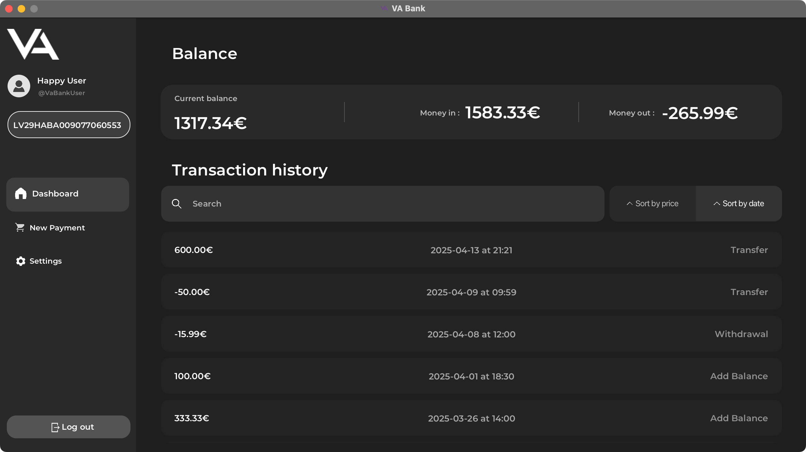

# VA Bank - Desktop Banking App

## 🧭 Table of Contents

1. [Introduction](#introduction)
2. [Features](#features)
3. [UI Description](#ui-description)
4. [Step-by-Step Usage](#step-by-step-usage)
5. [Code Highlights](#code-highlights)
6. [Installation & Running](#installation--running)

---

## Introduction
**VA Bank** is a sleek and secure desktop banking application built entirely using JavaFX. This project is designed for local use, simulating core banking functionalities like user authentication, account management, and financial transactions. The application aims to give users an intuitive and professional-feeling banking experience.

---

## Features

- User registration/login with password validation
- Add, withdraw, and transfer money
- View balance and transaction history
- Edit user credentials and delete account
- Stylish dark-themed GUI

---

## UI Description

### 🔐 Login / Registration
- **Registration**: Users provide a unique username, first name, last name, and password. The app ensures the username is not already taken.


- **Login**: Users can log in using their username and password. Password visibility toggle is available for ease of use.


### 📊 Dashboard
- Displays **Current Balance**, **Total Money In**, and **Total Money Out**.
- A **Transaction History** list shows all recent activities.
- Users can **search transactions**, and sort them by price or date.




### 🛒 New Payment
- Allows selection of three transaction types: **Add money**, **Withdraw**, or **Transfer**.
- For transfer, users must enter a valid recipient account number.
- Validation ensures all fields are filled and properly formatted.


### ⚙️ Settings
- Users can change their username, first and last name, and update their password (requires current password).
- Account deletion option is also available.


---

##  Step-by-Step Usage

### 1. Launch the App

Double-click the `BankApp.exe` file (after following the download steps below) to launch the application.

<!-- Compile and run the JavaFX project by executing the `Main.java` file.

```bash
javac -d bin src/main/java/org/example/Main.java
java -cp bin org.example.Main
``` -->

### 2. Create an Account
- Click on **"Don't have an account?"**
- Fill in your desired **username**, **first name**, **last name**, and **password**.
- Click **Sign Up**.

### 3. Log In
- Enter your username and password.
- Click **Login**.

### 4. Use the Dashboard
- Review your balance and transaction history.
- Use the search field to filter transactions.
- Use sorting buttons to arrange by date or amount.

### 5. Make a Payment
- Navigate to **New Payment**.
- Select transaction type.
- Provide amount and account number (if transferring).
- Click **Complete**.

### 6. Manage Your Account
- Go to **Settings**.
- Update your profile or password.
- Optionally delete your account.

### 7. Log Out
- Click the **Log-out** button on the bottom left.


---

## Code Highlights

### 🛂 Login Logic
```java
private User signIn() throws FieldsAreBlankException, NoSuchUserException {
    userMessage.setText("");
    checkIfBlankInLogin();
    String login = this.usernameField.getText();
    String password = this.passwordField.getText();
    return database.checkUser(login, password);
}
```

### 💳 Payment Flow
```java
public Transaction createTransaction() throws TypeOrFieldsNotSetException {
    TransactionType type;
    if (addMoneyButton.isSelected()) {
        type = TransactionType.ADDTOBALANCE;
    }
    else if (withdrawButton.isSelected()) {
        type = TransactionType.WITHDRAWAL;
    }
    else if (transferButton.isSelected()) {
        type = TransactionType.TRANSFER;
    }
    else type = null;

    if (type != null 
    && !amountField.getText().isBlank() 
    && (accNumField.isDisable() 
    || (!accNumField.isDisable() && !accNumField.getText().isBlank())))  {
        BigDecimal amount = new BigDecimal(amountField.getText()).setScale(2);
        return new Transaction(amount, type);
    } else throw new TypeOrFieldsNotSetException();
}
```

### ✅ Input Validation
```java
public void validatePass(String password){
    if((!password.matches("^(?=.*[A-Za-z])(?=.*\\d).{8,}$"))){
        System.out.println("Not a valid password");
        throw new NotValidPasswordException();
    }
}

public void validateUsername(String username) throws UserExistsException {
    if(!username.matches("^(?=.{8,20}$)(?![_.])(?!.*[_.]{2})[a-zA-Z0-9._]+(?<![_.])$")){
        System.out.println("Not a valid username");
        throw new NotValidUsernameException();
    }
    db.checkUsername(username);
}
```

---

## Installation & Running

Below is the simplest way to install and run **BankApp**:

1. **Download the Project from GitHub**  
   - Visit the project’s GitHub repository and click the green **Code** button.  
   - Download the ZIP or clone the repository to your local machine.

2. **Locate the `.exe` File**  
   - Once downloaded, look inside the project folder for **`BankApp.exe`**.

3. **Run the `.exe` File**  
   - Double-click the `.exe` to launch the application.  
   - On some systems, you may see a security prompt—allow the application to run if prompted.
